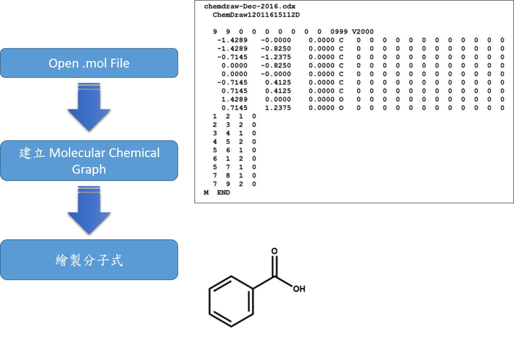
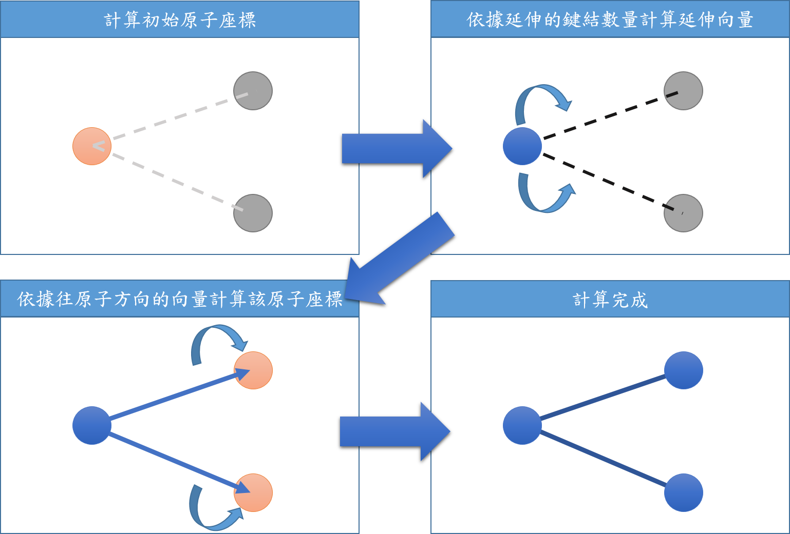
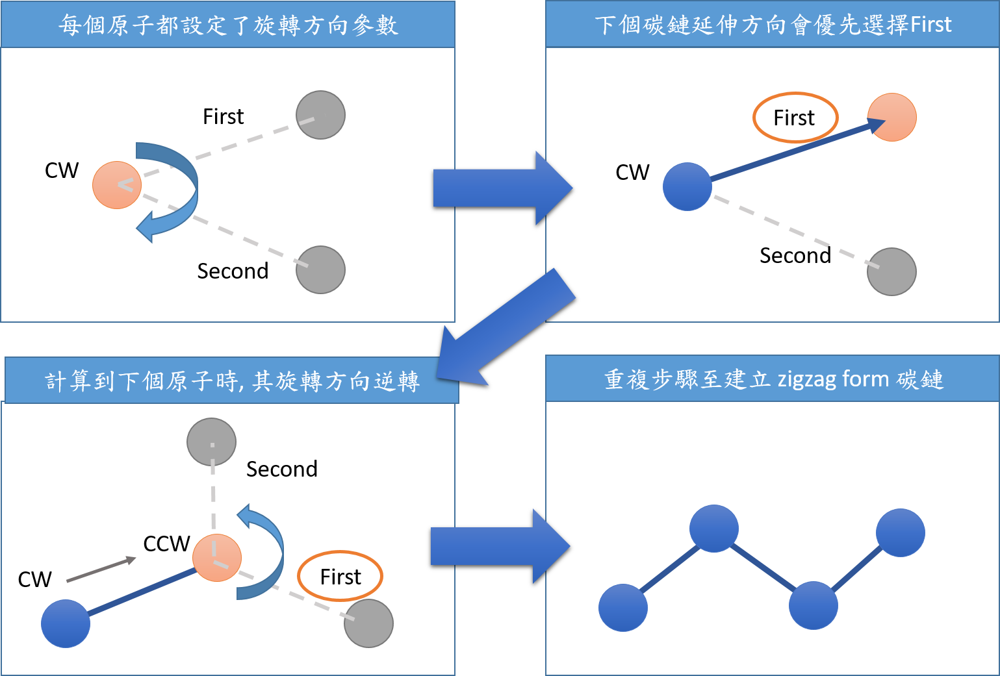
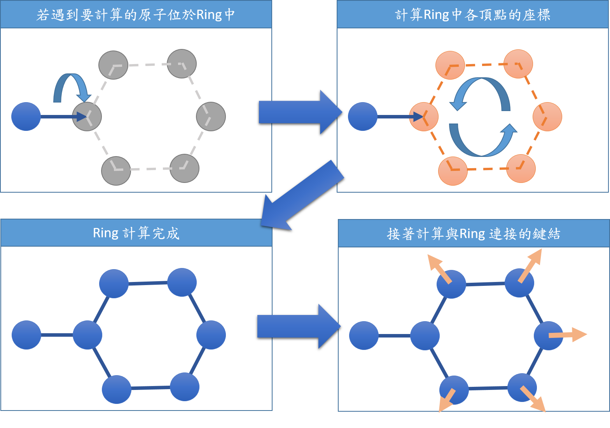
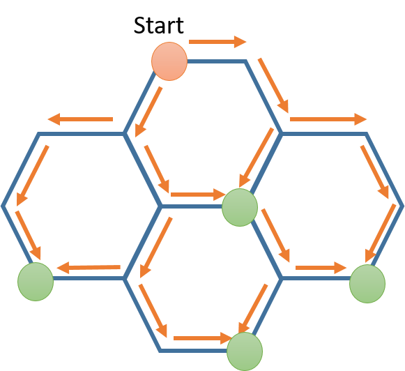
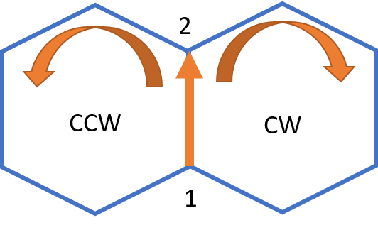
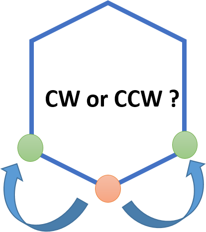
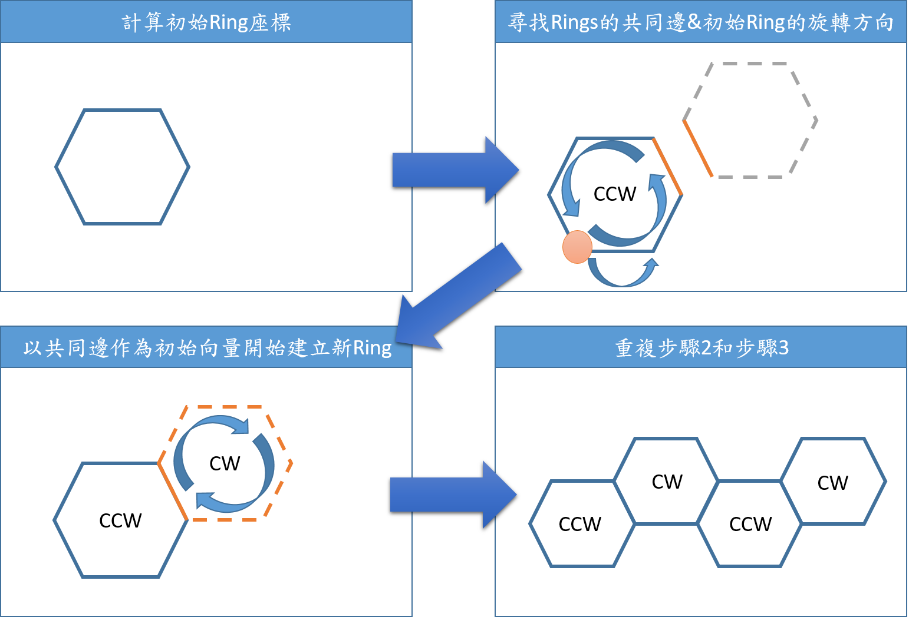
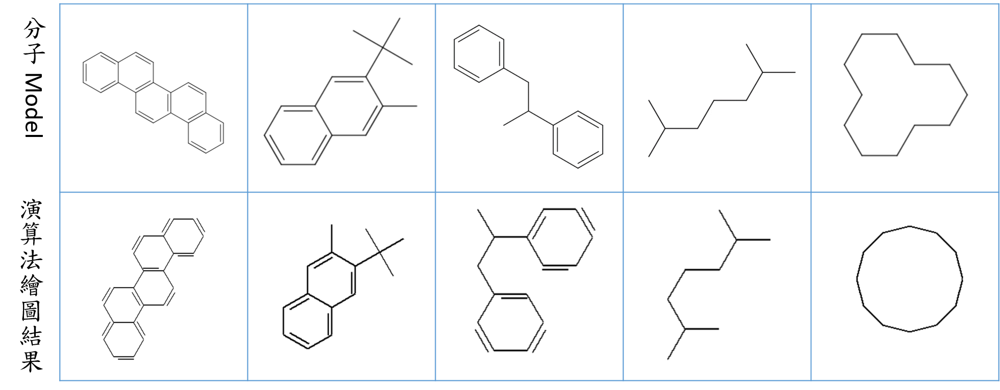
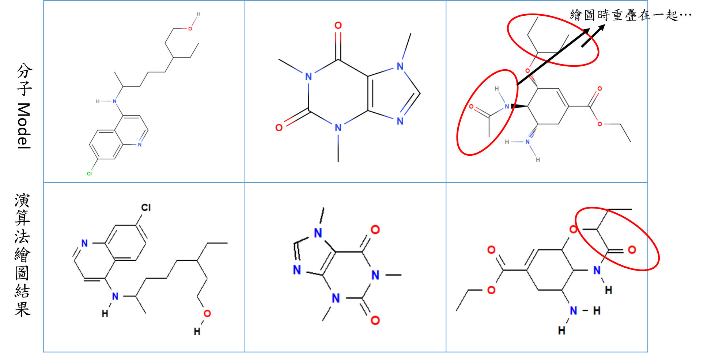

##**RenderMol2D Note**

###**一、 程式流程**
- 1. 開啟 .mol 檔案
- 2. 製作分子的 graph 結構
- 3. 繪製分子

---

###**二、演算法流程**
演算法之進行, 相似於 graph 的 traversal 動作, 拜訪 graph 的頂點時,計算該頂點的座標，此分子繪圖演算法則是依 BFS 形式進行拜訪。

---

###**三、Theory**
演算法實作部分會分為三大部分，分別為(1)碳鏈的延伸、(2)Ring的建立、(3)Fused Ring的建立。
###3.1. 碳鏈的延伸
在計算上，使用向量來逐步延伸碳鏈

在每個頂點(原子)上新增旋轉方向的參數，用於描述向量方向的優先選擇順序。每當訪一個頂點，旋轉方向則逆轉，以此方法建立 zigzag 型式的碳鏈。

由於該方案無法依據立體障礙來決定碳鏈延伸方向，故待改善。

###3.2. Ring 
在進行分子繪圖演算法前，會針對分子的graph結構進行搜尋，主要尋找 Ring 與 Fused Ring，方便於辨別 graph 中的頂點是否屬於前兩者。
Graph 中尋找 Ring 或是 Fused Ring，可以歸類為尋找 biconnected component 之問題，因此使用著名的 Tarjan's Algorithm。

ref : https://www.geeksforgeeks.org/tarjan-algorithm-find-strongly-connected-components/
ref : https://www.geeksforgeeks.org/bridge-in-a-graph/

接著分子繪圖演算法在進行時，拜訪的頂點會先判斷是否為 Ring 或 Fused Ring的一部分，若為 Ring 的一部分，則繪圖方法如下

會直接把Ring的每個頂點建立出來，其方法為順著固定的旋轉方向，逐步旋轉向量來計算座標，此時的旋轉方向順時針或逆時針皆可。

###3.3. Fused Ring 
###3.3.1. Ring Perception
Fused Ring 的處理則如同 Ring，在分子繪圖演算法前先利用 Tarjan's Algorithm 搜尋出來。然而，利用Tarjan's Algorithm 切割出來的子圖，只能保證為 ring system ( biconnected graph )，而難以判別是 Ring 還是 Fused Ring，此為 Ring Perception的問題，本演算法使用下面文獻中的方法來進行。

ref : 
Ring Perception Using Breadth-First Search
J. Chem. Inf. Comput. Sci.1996365986-991
https://pubs.acs.org/doi/abs/10.1021/ci960013p

該文獻中使用BFS進行graph traversal，當頂點的尋訪相會時，此時表示有一個最小單位圓。若最後的尋訪結果最小單位圓只有一個時，即可知道子圖為 Ring，反之為複數，則為Fused Ring。而 Fused Ring 亦以最小單位圓的形式進行儲存，有利於後續演算法的進行。

###3.3.2. Ring Sequence
在本程式中，ring是以一串數列做儲存，其中數字表示頂點編號。

    Ring1   [ 1,2,3,4,5,6 ]
    Ring2   [ 9,8,7,6,2,1 ]
若以 Ring1 為基底建立貼合的 Ring2，此外 Ring1 各頂點的座標皆已知時，此時會調整 Ring2 的sequence，以共同邊作為起頭。

    Ring2   [1,2,6,7,8,9]
此時會以 [1,2] 這兩個 ring 的共同邊作為起始向量，接著旋轉此向量依序建立 Ring2 各頂點的座標。

該旋轉角度除了依據 ring 的頂點數，亦根據 Ring1 的旋轉方向。由於使用了共同邊( 共同向量 )，故若使用了相同的旋轉方向且兩者ring的頂點數皆相同時，會造成 Ring2 的座標與 Ring1 重疊，因此須以相反的旋轉方向旋轉向量。

另外關於求得 Ring1 的旋轉方向問題，可以尋找 Ring1 最低點的位址，接著觀察最低點的下個點之x座標，若下的點的x座標大於最低點的x座標，則為CCW，反之低於最低點，則為CW。

###3.3.3. Fused Ring 建立步驟

###**四、結果**

---

###五、未來方向
- 1. 碳鏈延伸演算法中加入碰撞偵測與立體障礙的修正( 角度、鍵長、配位方向 )，使畫出的分子式更符合使用習慣的形式。
- 2. 目前演算法只適用於鍵結數目 4 以下，當有原子鍵結數目超過此數目( 如金屬配位)，則不適用，此外亦無法畫三鍵。
- 3. 雙鍵有順反異構物，此演算法暫無法處理此問題
- 4. 若是立體結構(如 cubic)亦不適用
- 5. 針對環形狀的建立，可以使用Ring Template Databases法(RTD)

---
###六、參考資料
Tarjan's Algorithm
https://www.geeksforgeeks.org/tarjan-algorithm-find-strongly-connected-components/

https://www.geeksforgeeks.org/bridge-in-a-graph/

OpenEye - Bibliography - 2D Coordinate Generation
https://docs.eyesopen.com/toolkits/python/oechemtk/2Dcoordinates.html

相關慘考文獻
2D-Structure Drawings of Similar Molecules
https://link.springer.com/chapter/10.1007/3-540-44541-2_11

Structure Diagram Generation
https://onlinelibrary.wiley.com/doi/10.1002/9780470125908.ch6

Automated drawing of structural molecular formulas under constraints.
https://www.ncbi.nlm.nih.gov/pubmed/15154775

2D Structure Depiction
https://pubs.acs.org/doi/abs/10.1021/ci050550m

Ring Perception Using Breadth-First Search
https://pubs.acs.org/doi/abs/10.1021/ci960013p